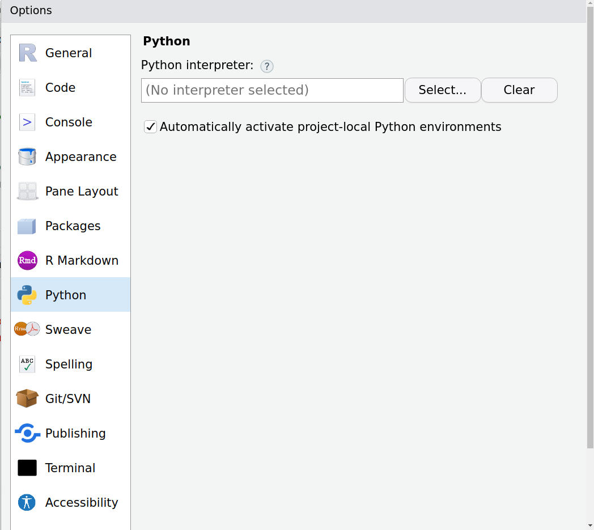
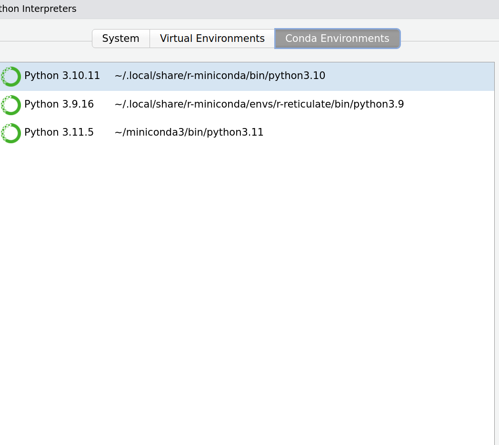

```{r, include = FALSE}
knitr::opts_chunk$set(
  collapse = TRUE,
  comment = "#>"
)
```

This vignette provides guidance on troubleshooting issues related to Python 
module dependencies when using R.

## Module not found error in Rstudio

You might encounter an error message similar to this:

```
Error in py_run_string_impl(code, local, convert) : 
  ModuleNotFoundError: No module named 'torch'
Run `reticulate::py_last_error()` for details.
```

This might mean that the python dependencies were not installed. `pangoling` 
provides a convienence function to install the necessary python dependencies in a *conda* environment:

```{r, eval = FALSE}
install_py_pangoling()
```

`pangoling` (as many other R packages) relies on `reticulate` for  Python
functionality. Even if the package installation seems successful, the issue may 
be that `reticulate` is not correctly loading the correct Python environment. By
default, R should use the a *conda* environment named `r-reticulate` when 
managing these configurations automatically.

One can verify this by using `py_config`, this is the output in a linux computer
where the conda environment **wasn't** loaded:

```{r}
library(reticulate)
```
```{r, eval= FALSE}
py_config()
```
```{r}
#> python:         /usr/local/bin/python
#> libpython:      /usr/lib/python3.10/config-3.10-x86_64-linux-gnu/libpython3.10.so
#> pythonhome:     //usr://usr
#> version:        3.10.12 (main, Jun 11 2023, 05:26:28) [GCC 11.4.0]
#> numpy:           [NOT FOUND]
#> 
#> NOTE: Python version was forced by RETICULATE_PYTHON_FALLBACK
```

One can anyways configure RStudio to load the correct conda environment
(`r-reticulate`) by default following these steps:

1. In RStudio, navigate to the "Tools" menu.

2. Click on "Global Options" in the "Tools" menu.

3. Click on Python.

```{r, echo=FALSE}

```

4. Click on Select...

5. Click on the Conda Enviornment tab.

6. Click on the r-reticulate path.

```{r, echo=FALSE}

```

7. Click on the Select button on the bottom.

The path that was selected should appear now when using `py_config()`:

```{r}
py_config()
```


## HTTPSConnectionPool error

A `causal_` or `masked_` commands throws an error that starts as follows:

```
Error in py_run_string_impl(code, local, convert) :
requests.exceptions.SSLError: HTTPSConnectionPool(host='huggingface.co', port=443): 
```

The first time a model is run, it will download some files that will be 
available for subsequent runs. So if there is no internet connection (or the
[huggingface](https://huggingface.co/) website is down) during the first run, 
one will experience this problem. Afterwards, it is possible to use `pangoling`
without an internet connection. 

